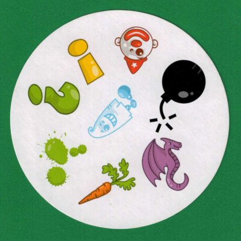
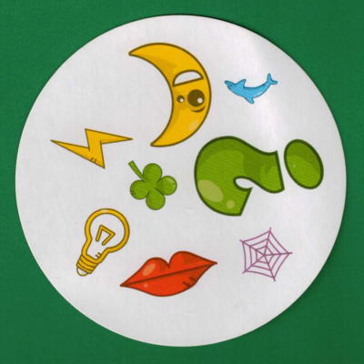

# Spot It
Traditional CV algorithms built from scratch to solve the kids’ game of [Spot It](https://www.youtube.com/watch?v=Bc1f-aulfgg).
## Description
Segmentation: thresholding, sequential labeling.  
Merging: Moore-Neighbor tracing, color distance, L1 distance.  
Matching: color distance, Hu Moments.  
Mask generation: flood fill.  
`opencv-python` is required, but only I/O functions are used. Algorithms are implemented using `numpy`. Bottlenecks are in function `sequential_label` and `merge_objs`, which are hard to vectorize.  
All magic numbers are explicitly stated.  
20/20 accuracy on the given cards and images dataset.
## Usage
```sh
python3 spotit.py cards cards/001.png cards/002.png result/cards12.png
```
The input images are
|
-|-

and the result is


To get all results in a category, run
```
for((i=1; i<=4; i++)); do
    for((j=i+1; j<=5; j++)); do
        python3 spotit.py images images/00$i.png images/00$j.png result/images$i$j.png
    done
done
```
in bash.
